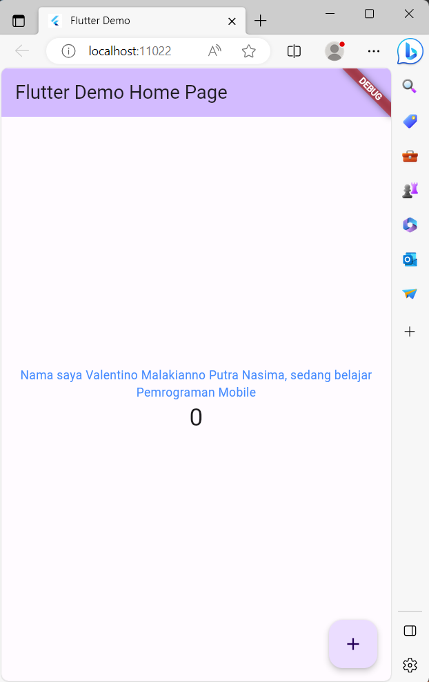
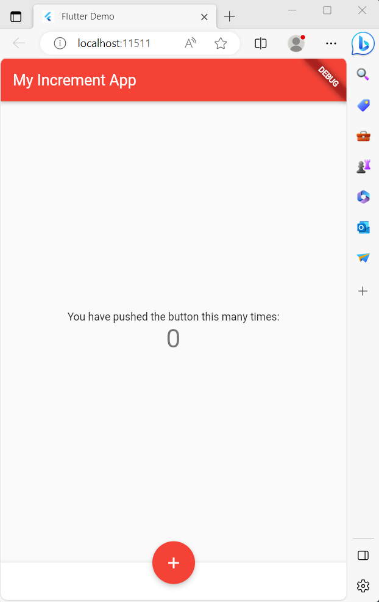
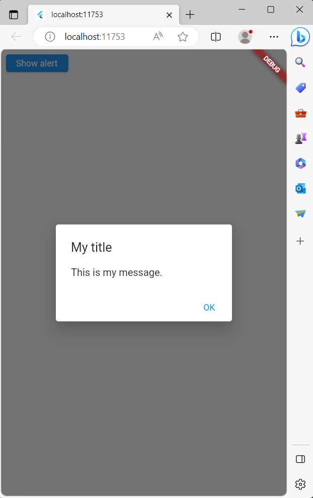
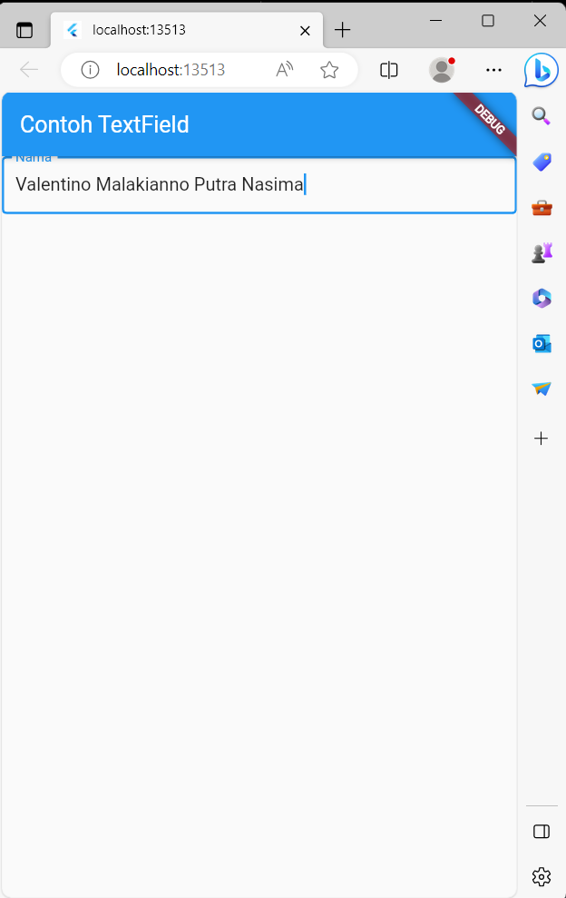
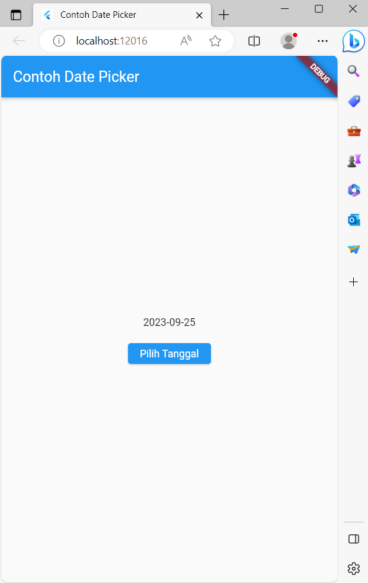

# flutter_praktikum_5

## Praktikum 3
### Langkah 1 : Text Widget
Mengganti isi teks dengan nama lengkap dan warnanya menjadi biru

### Langkah 2 : Image Widget
Menambahkan Logo Polinema

## Praktikum 4
### Scaffold Widget
scaffold widget digunakan untuk mengatur tata letak sesuai dengan material design

### Dialog Widget
menambahkan alert dialog

### Input and Selection Widget
Menambahkan widget berupa input field untuk menerima inputan dari user

### Date and Time Picker 
Menambahkan date and time picker, user bisa menginputkan tanggal sesuai keinginan
 